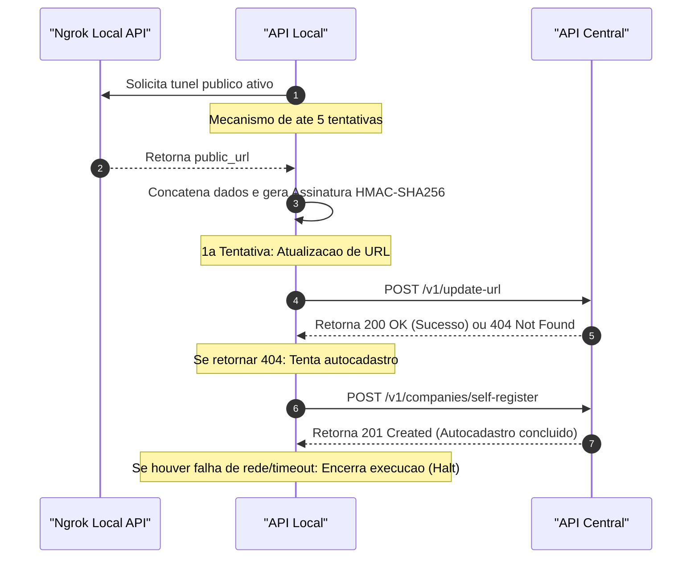

# API-Local (On-Premises ERP Integration Gateway)

> **API Local para Sincronização Dinâmica e Integração do Dashboard**  
> Desenvolvida em Delphi 10.2 (Tokyo) utilizando o micro-framework **Horse**, esta API atua em cada servidor local (on-premises) dos clientes, servindo como uma ponte segura entre a base de dados local (Firebird SQL) e o Dashboard Web centralizado.

---

## Visão Geral do Sistema

O **API-Local** é o componente on-premises da arquitetura do ERP Híbrido. Ele resolve o desafio do roteamento dinâmico obtendo seu próprio endereço público temporário (gerado por túneis como o Ngrok) e registrando-o na **API-Central** de forma autônoma e segura.

Uma vez sincronizado, o Dashboard Web centralizado obtém essa URL pública através do JWT de autenticação e faz as consultas operacionais de forma direta e segura no servidor local da empresa, mantendo os dados confidenciais do cliente sob seu controle direto.



---

## Funcionalidades Críticas de Sincronização (`update-url`)

A integração de sincronização foi projetada para ser robusta, automatizada e totalmente segura contra ataques ou instabilidades de rede.

### 1. Descoberta Automática de Túnel (Ngrok)
Durante a inicialização, a API Local consome dinamicamente a API interna do Ngrok (`http://127.0.0.1:4040/api/tunnels`) para descobrir qual URL pública foi gerada para o seu túnel. 
*   **Resiliência com Retry:** Possui um loop resiliente que tenta coletar a URL até 5 vezes com intervalos de 1 segundo para garantir compatibilidade caso o Ngrok ainda esteja subindo.
*   **Pathing Dinâmico:** Assim que localiza a URL, acopla o base path `/v1` a ela antes de enviá-la para a API Central.

### 2. Fluxo Heartbeat em Duas Etapas (Fallback de Autocadastro)
A API Local envia as coordenadas à API Central seguindo uma estratégia de duas vias para simplificar o setup de novos clientes:
1.  **Primeira Tentativa (Atualização Padrão):** chama `POST /v1/update-url` com CNPJ normalizado, URL pública, timestamp ISO8601 e assinatura digital HMAC. Se a API Central retornar **200 OK**, a URL foi atualizada com sucesso.
2.  **Segunda Tentativa (Autocadastro com Fallback):** caso o servidor central responda com **404 Not Found** (indicando que a empresa ainda não está cadastrada na Central), a API Local chama `POST /v1/companies/self-register` com CNPJ normalizado, nome da empresa, URL pública, claim, timestamp e assinatura. O autocadastro é considerado bem-sucedido quando a API Central retorna **201 Created**.

### 3. Claim da Empresa
Durante a inicialização, a API Local gera e exibe no terminal um claim determinístico da empresa. Esse claim deve ser informado no Dashboard para vincular a empresa ao cliente autenticado.

O claim é sempre o mesmo para a mesma empresa e é calculado da seguinte forma:
```text
SHA256(cnpj_normalizado + JWT_SECRET)
```

O nome enviado no autocadastro é lido do campo `EMP_FANTASIA`.

### 4. Assinatura Digital Criptográfica (HMAC-SHA256)
Para blindar o endpoint de sincronização na nuvem e evitar sequestro de URLs por atacantes externos, cada requisição de presença é assinada digitalmente:
*   A API Local lê o CNPJ da empresa do banco local e normaliza o valor para apenas números.
*   Gera um timestamp no padrão ISO8601.
*   Para `POST /v1/update-url`, concatena as strings na ordem exata: `cnpj_normalizado + url + timestamp`.
*   Para `POST /v1/companies/self-register`, concatena as strings na ordem exata: `cnpj_normalizado + nome + url + claim + timestamp`.
*   Aplica **HMAC-SHA256** utilizando o CNPJ normalizado como chave, resultando no parâmetro `assinatura`.

### 5. Mecanismo Fail-Fast de Segurança Física
Caso a API Local não consiga se comunicar com a API Central por falhas de infraestrutura, expiração de timeouts ou queda total de internet:
*   A aplicação intercepta a exceção silenciosamente.
*   Printa uma mensagem clara de erro no terminal: `Encerrando o programa. Conexão com a API de Autenticação não estabelecida`.
*   Chama a diretiva do sistema operacional `Halt(1)` para encerrar a API Local imediatamente. Isso previne que a API Local rode em "limbo offline", gerando inconsistências no ERP ou no Dashboard.

---

## Mecanismo de Logs e Auditoria

A API Local possui um sistema de auditoria e monitoramento de tráfego de requisições integrado e de alta performance.

### 1. Middleware Oficial `Horse.Logger`
O servidor utiliza o middleware oficial do ecossistema Horse (`Horse.Logger`) registrado no arquivo principal `api_dashboard.dpr`:
```pascal
THorse.Use(THorseLoggerManager.HorseCallback)
```

Para abranger tanto a observabilidade imediata em desenvolvimento quanto a persistência histórica em produção, estão configurados e registrados simultaneamente dois provedores (providers):
*   **Console Provider (`THorseLoggerProviderConsole`)**: Direciona e formata as informações de todas as requisições HTTP em tempo real diretamente para o console/terminal da aplicação.
*   **LogFile Provider (`THorseLoggerProviderLogFile`)**: Grava e armazena os registros estruturados das requisições em arquivos físicos `.log` no diretório do servidor local.

---

## Segurança e Autenticação JWT

Com exceção das rotas públicas necessárias para documentação, todos os endpoints expostos pela API Local são estritamente protegidos.

### Middleware de Autenticação (`AuthMiddleware.pas`)
O controle de acesso é gerenciado de maneira centralizada pelo middleware `TAuthMiddleware.RegisterAuthMiddleware`, que utiliza a biblioteca oficial `Horse.JWT` e realiza a inicialização:
```pascal
JWT_SECRET := TConstants.JWT_SECRET;
THorse.Use(HorseJWT(JWT_SECRET, THorseJWTConfig.New.SkipRoutes([...])));
```

*   **Validação de Assinatura:** Qualquer requisição HTTP direcionada aos endpoints de recursos deve conter no cabeçalho a diretiva de autenticação `Authorization: Bearer <TOKEN>`. A API Local valida o token emitido pela API de Autenticação usando a mesma chave JWT configurada em `TConstants.JWT_SECRET`.
*   **Rotas Públicas Ignoradas (Bypassed):** Para viabilizar a auditoria operacional e o teste das interfaces documentadas localmente, as seguintes rotas foram configuradas no `SkipRoutes` e não exigem autenticação JWT:
    *   `/favicon.ico`
    *   `/swagger/doc/html` (Interface interativa do Swagger UI)
    *   `/swagger/doc/html/*` (Arquivos estáticos da interface Swagger)
    *   `/swagger/doc/json` (Especificação OpenAPI estruturada em JSON)

---

## Endpoints Operacionais, Busca Global e Paginação

Todos os endpoints operacionais de listagem (`GET`) da API Local são robustos, performáticos e fornecem suporte integrado a paginação e busca global avançada no banco de dados Firebird SQL.

### 1. Parâmetros de Query Suportados
Ao consultar qualquer endpoint de listagem, podem ser informados na query string os seguintes parâmetros opcionais:
*   `search` (String): Executa uma busca global em múltiplos campos de texto indexados no banco de dados.
*   `limit` (Integer): Determina a quantidade máxima de registros retornados em uma única página. **(Valor padrão: 10)**.
*   `page` (Integer): Especifica o índice da página de dados desejada. **(Valor padrão: 1)**.

### 2. Paginação em Nível de Banco de Dados
Para garantir tempo de resposta rápido e baixo consumo de memória, a paginação é executada diretamente no banco de dados Firebird SQL. O middleware de controle calcula o offset dinamicamente:
```pascal
Pular := (Pagina - 1) * Limite;
```
Este cálculo é injetado diretamente na query SQL utilizando a cláusula de paginação nativa:
```sql
SELECT FIRST :limit SKIP :skip DISTINCT <Campos> FROM <Tabela>
```

### 3. Tabela Completa de Endpoints Ativos

| Endpoint | Método | Requer Autenticação JWT? | Campos Abrangidos pela Busca Global (`search`) | Parâmetros de Query Suportados |
| :--- | :--- | :--- | :--- | :--- |
| `/v1/clientes` | `GET` | **Sim** | `CLI_NOME` (Nome), `CLI_CELULAR` (Celular), `CLI_EMAIL` (E-mail), `CLI_CIDADE` (Cidade), `CLI_UF` (UF) | `limit`, `page`, `search` |
| `/v1/clientes/:id` | `GET` | **Sim** | *N/A (Retorna um cliente específico)* | N/A |
| `/v1/clientes/:id/valor-devedor` | `GET` | **Sim** | *N/A (Retorna o valor devedor de um cliente)* | N/A |
| `/v1/produtos` | `GET` | **Sim** | `PRO_NOME` (Nome), `PRO_FABRICANTE` (Fabricante), `PRO_CODBARRA` (Código de barras) | `limit`, `page`, `search`, `stockStatus` |
| `/v1/produtos/:id` | `GET` | **Sim** | *N/A (Retorna um produto específico)* | N/A |
| `/v1/movimentacoes` | `GET` | **Sim** | `MOV_DESCRICAO` (Descrição), `MOV_NOME` (Nome) | `limit`, `page`, `search`, `startDate`, `endDate`, `con` |
| `/v1/movimentacoes/:id`| `GET` | **Sim** | *N/A (Retorna uma movimentação específica)* | N/A |
| `/v1/movimentacoes/contas` | `GET` | **Sim** | *N/A (Retorna contas financeiras)* | N/A |
| `/v1/recebimentos` | `GET` | **Sim** | `r.REC_DUPLICATA` (Duplicata), `r.REC_OBS` (Observação) | `limit`, `page`, `search`, `startDate`, `endDate` |
| `/v1/recebimentos/:id` | `GET` | **Sim** | *N/A (Retorna um recebimento específico)* | N/A |
| `/v1/vendas` | `GET` | **Sim** | ID da venda, ID do vendedor, nome funcionário, nome vendedor | `limit`, `page`, `search`, `startDate`, `endDate` |
| `/v1/vendas/:id` | `GET` | **Sim** | *N/A (Retorna uma venda específica)* | N/A |
| `/v1/vendas/:id/resumo` | `GET` | **Sim** | *N/A (Retorna resumo das parcelas de uma venda)* | N/A |
| `/v1/os` | `GET` | **Sim** | ID da OS, nome funcionário, nome cliente | `limit`, `page`, `search`, `startDate`, `endDate` |
| `/v1/os/:id` | `GET` | **Sim** | *N/A (Retorna uma ordem de serviço específica)* | N/A |
| `/v1/dashboard/clientes-cidade` | `GET` | **Sim** | *N/A (Retorna agregação de clientes por cidade)* | N/A |
| `/v1/dashboard/despesas-tipo-pagamento` | `GET` | **Sim** | *N/A* | `limit`, `page`, `search`, `startDate`, `endDate` |
| `/v1/dashboard/vendas-margem-lucro` | `GET` | **Sim** | *N/A* | `limit`, `page`, `search`, `startDate`, `endDate` |
| `/v1/dashboard/os-margem-lucro` | `GET` | **Sim** | *N/A (Retorna histórico de faturamento e margem de lucro de OS por data)* | `startDate`, `endDate` |
| `/v1/dashboard/vendas-lucro-grupo` | `GET` | **Sim** | *N/A* | `limit`, `page`, `search`, `startDate`, `endDate` |
| `/v1/dashboard/tipos-pagamentos-compras` | `GET` | **Sim** | *N/A* | `limit`, `page`, `search`, `startDate`, `endDate` |
| `/v1/dashboard/tipos-pagamentos-recebimentos` | `GET` | **Sim** | *N/A* | `limit`, `page`, `search`, `startDate`, `endDate` |
| `/v1/dashboard/tipos-pagamentos-pagamentos` | `GET` | **Sim** | *N/A* | `limit`, `page`, `search`, `startDate`, `endDate` |
| `/v1/dashboard/movimentacoes` | `GET` | **Sim** | *N/A (Retorna histórico diário agrupado de crédito/débito)* | `startDate`, `endDate` |
| `/v1/dashboard/vendas-diarias` | `GET` | **Sim** | *N/A (Retorna histórico diário de vendas, maior venda e quantidade de vendas)* | `startDate`, `endDate` |
| `/v1/dashboard/vendas-diarias/hora` | `GET` | **Sim** | *N/A (Retorna o sumário de vendas por hora agrupados)* | `startDate`, `endDate` |
| `/v1/dashboard/os-diarias` | `GET` | **Sim** | *N/A (Retorna histórico diário de OS, maior OS e quantidade de OS)* | `startDate`, `endDate` |
| `/v1/dashboard/tipos-pagamentos-vendas` | `GET` | **Sim** | *N/A (Retorna vendas acumuladas por tipo de pagamento)* | `startDate`, `endDate` |
| `/ping` | `GET` | **Não** | *N/A (Retorna apenas "Pong" para testes de conectividade)* | N/A |

---

### 4. Endpoints de Agregação para Dashboard (Novidade 🚀)

Para alimentar a interface de gráficos dinâmicos no Dashboard Frontend de forma assíncrona e performática, foram desenvolvidos treze endpoints sob o prefixo `/v1/dashboard`. 

Esses endpoints realizam agregação pesada diretamente no banco de dados Firebird SQL (usando `GROUP BY`, `SUM` e `COUNT`) e retornam a estrutura de dados encapsulada sob a chave `"data"`, otimizando drasticamente o consumo de banda e acelerando o carregamento dos componentes gráficos:

*   **`GET /v1/dashboard/clientes-cidade`**:
    Retorna a contagem de clientes distribuídos por cidade.
    *   **Formato de resposta:**
        ```json
        {
          "data": [
            { "cidade": "Campinas", "clientes": 142 },
            { "cidade": "São Paulo", "clientes": 89 }
          ]
        }
        ```
*   **`GET /v1/dashboard/despesas-tipo-pagamento`**:
    Retorna o total de despesas, custos, impostos, compras, folha, fretes, empréstimos e lançamentos diversos agrupado por tipo de operação e tipo/forma de pagamento. Suporta filtros opcionais `startDate` e `endDate`.
    *   **Formato de resposta:**
        ```json
        {
          "data": [
            { "tipo_operacao": "DESPESA", "tipo_pagamento": "DINHEIRO", "valor": 1250.00 }
          ]
        }
        ```
*   **`GET /v1/dashboard/vendas-margem-lucro`**:
    Retorna o valor total das vendas e o respectivo lucro líquido por data. Suporta filtros opcionais `startDate` e `endDate`.
    *   **Formato de resposta:**
        ```json
        {
          "data": [
            { "data": "2026-06-01", "valor": 25000.00, "margem_lucro": 4500.00 }
          ]
        }
        ```
*   **`GET /v1/dashboard/os-margem-lucro`**:
    Retorna o sumário de faturamento e a margem de lucro de Ordens de Serviço (soma de lucro de produtos e serviços) agrupado por data. Suporta filtros opcionais `startDate` e `endDate`.
    *   **Formato de resposta:**
        ```json
        {
          "data": [
            { "data": "2026-06-01", "valor": 18500.00, "margem_lucro": 3200.00 }
          ]
        }
        ```
*   **`GET /v1/dashboard/vendas-lucro-grupo`**:
    Retorna a soma de vendas e o respectivo lucro acumulado por grupo principal de produtos. Suporta filtros opcionais `startDate` e `endDate`.
    *   **Formato de resposta:**
        ```json
        {
          "data": [
            { "nome": "Grupo A", "valor": 12000.50, "lucro": 3000.20 }
          ]
        }
        ```
*   **`GET /v1/dashboard/tipos-pagamentos-compras`**:
    Retorna o valor das compras realizadas agrupadas por tipo/forma de pagamento. Suporta filtros opcionais `startDate` e `endDate`.
    *   **Formato de resposta:**
        ```json
        {
          "data": [
            { "tipo_pagamento": "BOLETO BANCARIO", "valor": 8500.00 }
          ]
        }
        ```
*   **`GET /v1/dashboard/tipos-pagamentos-recebimentos`**:
    Retorna o valor de contas recebidas agrupadas por tipo/forma de pagamento. Suporta filtros opcionais `startDate` e `endDate`.
    *   **Formato de resposta:**
        ```json
        {
          "data": [
            { "tipo_pagamento": "PIX", "valor": 3200.00 }
          ]
        }
        ```
*   **`GET /v1/dashboard/tipos-pagamentos-pagamentos`**:
    Retorna o valor de contas pagas agrupadas por tipo/forma de pagamento. Suporta filtros opcionais `startDate` e `endDate`.
    *   **Formato de resposta:**
        ```json
        {
          "data": [
            { "tipo_pagamento": "DEPOSITO BANCARIO", "valor": 6100.00 }
          ]
        }
        ```
*   **`GET /v1/dashboard/movimentacoes`**:
    Retorna um sumário diário contendo os valores totais de entrada (créditos) e saída (débitos) agrupados por data. Suporta filtros opcionais `startDate` e `endDate`.
    *   **Formato de resposta:**
        ```json
        {
          "data": [
            { "data": "2026-06-01", "credito": 15000.50, "debito": 8500.20 }
          ]
        }
        ```
*   **`GET /v1/dashboard/vendas-diarias`**:
    Retorna o sumário diário contendo o valor total de vendas, o valor da maior venda registrada no dia e a quantidade de vendas, agrupado por data. Suporta filtros opcionais `startDate` e `endDate`.
    *   **Formato de resposta:**
        ```json
        {
          "data": [
            { "data": "2026-06-01", "valor": 25000.00, "maior_venda": 4500.00, "quantidade": 15 }
          ]
        }
        ```
*   **`GET /v1/dashboard/vendas-diarias/hora`**:
    Retorna o sumário de vendas agrupado por hora. Suporta filtros opcionais `startDate` e `endDate`.
    *   **Formato de resposta:**
        ```json
        {
          "data": [
            { "hora": "14:30:00", "valor": 1250.00 }
          ]
        }
        ```
*   **`GET /v1/dashboard/os-diarias`**:
    Retorna o sumário diário contendo o valor total de Ordens de Serviço, o valor da maior OS registrada no dia e a quantidade de OS, agrupado por data. Suporta filtros opcionais `startDate` e `endDate`.
    *   **Formato de resposta:**
        ```json
        {
          "data": [
            { "data": "2026-06-01", "valor": 12000.00, "maior_os": 3500.00, "quantidade": 8 }
          ]
        }
        ```
*   **`GET /v1/dashboard/tipos-pagamentos-vendas`**:
    Retorna o valor total das vendas acumulado por tipo de pagamento (forma de pagamento). Suporta filtros opcionais `startDate` e `endDate`.
    *   **Formato de resposta:**
        ```json
        {
          "data": [
            { "tipo_pagamento": "DINHEIRO", "valor": 12500.00 },
            { "tipo_pagamento": "CARTAO DE CREDITO", "valor": 8500.00 }
          ]
        }
        ```

---

## Configuração do Ambiente e Requisitos

| Variável | Descrição | Exemplo |
| :--- | :--- | :--- |
| `CAMINHO_BD` | Caminho absoluto físico até o arquivo de banco Firebird SQL. | `C:\Estagio\API-Local\Dados\PRINCIPAL.FDB` |
| `PORT` | *(Opcional)* Porta HTTP na qual a API Local irá rodar. Se omitida, assume o valor padrão. | `9000` |

> [!NOTE]
> A URL do servidor de autenticação central agora está embutida diretamente na API (especificamente em [UnitConstants.pas](file:///c:/Users/nanan/Documents/Estudos%204%C2%B0%20Ano/Est%C3%A1gio/API-Local/src/utils/UnitConstants.pas#L17) como [TConstants.URL_AUTENTICACAO](file:///c:/Users/nanan/Documents/Estudos%204%C2%B0%20Ano/Est%C3%A1gio/API-Local/src/utils/UnitConstants.pas#L17)), portanto a configuração da variável de ambiente `URL_API_CENTRAL` não é mais necessária.

### Arquivos Locais e Bancos de Dados

A pasta `Dados/` é reservada para bancos Firebird, cópias locais e arquivos pesados usados em desenvolvimento ou implantação on-premises. Esses arquivos não devem ser enviados para o GitHub.

Antes de commitar, confirme que nenhum arquivo dessa pasta foi incluído no stage:

```bash
git status --short
git diff --cached --name-only
```

Se aparecer algum arquivo em `Dados/` no stage, remova-o do commit antes de subir:

```bash
git restore --staged Dados/
```

---

## Como Executar a API Local

### Pré-requisitos
1.  **Delphi 10.2 Tokyo** instalado em ambiente Windows.
2.  **Firebird SQL Server** (2.5 ou superior) ativo com o banco `PRINCIPAL.FDB`.
3.  **Ngrok** instalado e configurado (`ngrok config add-authtoken <TOKEN>`).
4.  **Boss** configurado no terminal da máquina local.

### Passo a Passo

1.  **Restaurar Dependências:**
    Abra o terminal no diretório da API-Local e execute:
    ```bash
    boss install
    ```

2.  **Definir Variáveis:**
    Configure a variável de sistema `CAMINHO_BD` no Windows. A chave JWT compartilhada com a API de Autenticação está definida em `TConstants.JWT_SECRET`.

3.  **Compilar e Iniciar:**
    *   Abra o arquivo `api_dashboard.dproj` no Delphi 10.2 Tokyo.
    *   Defina a build para `Debug` ou `Release` (Target Platform: `Win32`).
    *   Execute (`F9`).
    *   A API Local exibirá no terminal o claim da empresa e o executável do Ngrok subirá em paralelo automaticamente configurando a porta 9000.
    *   Use o claim exibido no terminal para vincular a empresa ao cliente pelo Dashboard.

4.  **Auditar Funcionamento:**
    Acesse no navegador a documentação interativa Swagger local:
    ```http
    http://localhost:9000/swagger/doc/html
    ```
