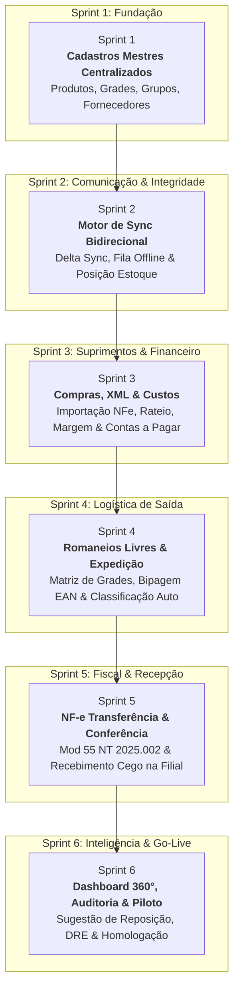

# 🗺️ Roadmap de Desenvolvimento — Centro de Distribuição (CD)

> **Documento Oficial de Planejamento e Execução de Sprints**  
> **Arquitetura:** Delphi + Horse + PortalORM (Backend Cloud / Central) | React + Design System (Frontend Portal) | Firebird Database | NotaFiscal Online API (NT 2025.002)  
> **Metodologia:** Scrum com Sprints Ágeis Acelerados por Agentes de IA (~3 a 4 dias úteis por Sprint ou ciclos semanais densos).

---

## 📌 1. Visão Geral e Objetivos do Projeto

O objetivo deste projeto é fornecer uma infraestrutura completa e moderna para o **Centro de Distribuição (CD Central / Nuvem)** e suas **5 Filiais** (`DOURADINA`, `RIO BRILHANTE`, `ITAPORA`, `NOVA ALVORADA`, `MARACAJU`), garantindo:

1. **Cadastros Mestres 100% Centralizados na Nuvem:** O CD Central em nuvem é o único detentor da criação e alteração de dados cadastrais (Produtos, Grupos, Subgrupos, Grades, Tamanhos, Fornecedores).
2. **Topologia de Lojas e Filiais:**
   - **Origem Central:** CD em Nuvem (Gestão de compras globais, estoques e expedição central).
   - **5 Filiais Receptoras:** `Douradina` (Empresa #5), `Rio Brilhante` (Empresa #6), `Itaporã` (Empresa #7), `Nova Alvorada do Sul` (Empresa #4), `Maracaju` (Empresa #8).
3. **Sincronização Bidirecional Resiliente (Delta Sync):**
   - **Downstream (CD ➔ Filiais):** Propagação automática de novos cadastros e alterações (`CADASTRAR = 'S'`).
   - **Upstream (Filiais ➔ CD):** Envio da posição consolidada de estoque (`ESTOQUE_EMPRESA`) e métricas do Dashboard Financeiro (`DATA_REF`).
4. **Regra Estrita de Movimentação de Estoque nas Filiais:** O estoque das filiais **NUNCA** é alterado manualmente; apenas por **venda local** ou por **transferência física/romaneio** recebido e conferido vindo do CD.
5. **Compras Inteligentes e Formação de Custos:** Entrada via XML de NF-e e manual, rateio de custos (fretes, impostos, despesas acessórias), formação de preço e geração automática de Contas a Pagar.
6. **Romaneios com Montagem Livre & Classificação Fiscal Automática:**
   - O operador monta o Romaneio de Envio com total liberdade (qualquer produto, grade de tamanhos ou código de barras bipado).
   - O **sistema classifica automaticamente** cada item:
     - **🏛️ Itens Fiscais (`PRO_FISCAL_GERAR = 'S'` ou `PRO_COD_FISCAL > 0`):** Agrupamento automático e emissão da NF-e de Transferência (Modelo 55 - CFOP 5152/6152).
     - **📦 Itens Físicos/Internos (`PRO_FISCAL_GERAR = 'N'`):** Movimentação e trânsito físico acompanhado da Guia de Separação e Carregamento (Romaneio A4 / Picking List).
7. **Recepção e Conferência Cega na Filial:** Na chegada do caminhão, a filial confere as quantidades físicas e aprova o recebimento com crédito imediato no estoque local.

---

## 🏛️ 2. Diagrama de Fluxo e Sprints



---

## 📅 3. Detalhamento dos Sprints de Desenvolvimento

---

### 🔹 Sprint 1: Cadastros Mestres & Usabilidade (CD)
> **Foco:** Base de dados única, modelagem no PortalORM, melhorias de interface no Portal React e refinamentos cadastrais.
> **Status:** 🟢 **Pronto / Em Melhorias Contínuas** (14/07 a 20/08/2026)

* **Backend (Delphi / Horse / PortalORM):**
  - [x] Modelagem das classes derivadas de `TTabela`: `TGrupos`, `TSubGrupos`, `TGrades`, `TTamanhos`, `TFornecedores`, `TProdutos`.
  - [x] DDL automática via PortalORM (`CriaTabela`), geração de ID via `GeraCodigo` e flags de sync (`CADASTRAR = 'S'`).
  - [x] Documentação Swagger com `Horse.GBSwagger`.
* **Frontend (React / Design System):**
  - [x] Telas administrativas no padrão `.crud-container`, matriz interativa de Grade x Tamanhos e remoção de campos desnecessários (balança).
* **Definition of Done (DoD):** Operador cadastra produtos e grades com rapidez e fluidez no CD.

---

### 🔹 Sprint 2: Comunicação & Sincronização (CD Central ⇄ 5 Filiais)
> **Foco:** Correção de divergências no envio de dados, fila de retentativa e preservação dos estoques locais.
> **Status:** 🔴 **Em Ajuste Imediato (Foco Atual)** (18/08 a 21/08/2026)

* **Fluxo Downstream (CD ➔ 5 Filiais):**
  - [x] Rota `/v1/sync/pending` e `/v1/sync/ack`.
  - [ ] **Correção de Divergência:** Ajustar ciclo de confirmação (`CADASTRAR = 'N'`) e trava de preservação do saldo local da loja.
* **Fluxo Upstream (Filiais ➔ CD):**
  - [ ] Envio consolidado para `ESTOQUE_EMPRESA` e vendas diárias para o Dashboard (`DATA_REF`).
* **Definition of Done (DoD):** Sincronização 100% íntegra entre o CD em nuvem e as 5 lojas.

---

### 🔹 Sprint 3: Entrada por XML de Compra, Custos & Contas a Pagar
> **Foco:** Leitura de XML de fornecedor, De-Para, vinculação de produtos existentes, cadastro rápido de itens, rateio de custos/fretes e duplicatas a pagar.
> **Status:** 🟡 **Validação Integrada** (22/08 a 26/08/2026)

* **Definition of Done (DoD):** Entrada de XML alimenta o CD e propaga para as filiais.

---

### 🔹 Sprint 4: Romaneios Livres, Bipagem & Expedição
> **Foco:** Montagem ágil de romaneios com matriz de grades, bipagem de código de barras, classificação fiscal automática e baixa do CD.
> **Status:** 🟢 **Implementado / Validação Integrada** (27/08 a 31/08/2026)

* **Funcionalidades Entregues:**
  - [x] **Livre Escolha de Itens:** Sem travas de "Fiscal vs Não Fiscal" no cabeçalho.
  - [x] **Matriz de Grades/Tamanhos:** Digitação ágil de quantidades por tamanho (P, M, G, GG ou 36..44) com visualização do estoque disponível no CD.
  - [x] **Leitor / Bipagem EAN:** Inclusão instantânea ao escanear código de barras.
  - [x] **Classificação Fiscal Automática:** Separação visual e quantitativa dos itens para NF-e vs Controle Físico.
  - [x] **Impressão Romaneio A4:** Guia de separação física (Picking / Packing List) com campos de assinatura.
* **Definition of Done (DoD):** Romaneio expedido no CD fica imediatamente visível para a filial em status `Em Trânsito`.

---

### 🔹 Sprint 5: Emissão Fiscal (NF-e Mod 55) & Conferência na Loja
> **Foco:** Emissão da NF-e oficial de transferência via nuvem (NT 2025.002) filtrando itens fiscais do romaneio e conferência física na chegada da filial.
> **Status:** 🔵 **Próxima Fase** (01/09 a 05/09/2026)

* **Definition of Done (DoD):** NF-e autorizada e conferida na ponta com crédito no estoque da loja.

---

### 🔹 Sprint 6: Painel de Vendas 360°, Sugestão de Reposição & Go-Live Final
> **Foco:** Visão executiva das 5 lojas, compras sugeridas e liberação final do sistema.
> **Status:** ⚪ **Entrega Final** (06/09 a 10/09/2026)

* **Definition of Done (DoD):** Sistema 100% entregue e operando em produção nas 5 unidades.

---

## 🛡️ 4. Matriz de Regras e Cuidados Críticos

| Regra / Desafio | Solução Arquitetural Aplicada |
| :--- | :--- |
| **Topologia de Lojas** | O CD fica em nuvem centralizando cadastros e compras; Douradina, Rio Brilhante, Itaporã, Nova Alvorada e Maracaju são as 5 filiais receptoras. |
| **Manipulação Indevida de Saldo na Filial** | O estoque da filial em `ESTOQUE_EMPRESA` **só pode ser alterado** por emissão de venda na ponta ou recebimento de romaneio do CD. |
| **Classificação de Romaneios** | O usuário tem total liberdade de montar a carga; o sistema separa os itens fiscais para NF-e e os físicos para controle de carga. |
| **DDL no Banco Firebird** | Uso estrito das classes `TTabela` do **PortalORM** com `CriaTabela`. Proibido `ALTER TABLE` manual. |
| **Execução de Queries sem Retorno** | Padrão obrigatório `LQuery.Clear; LQuery.Add('...'); LQuery.ExecSQL;` (sem passar string no `ExecSQL`). |
| **Reforma Tributária NT 2025.002** | Payload da NotaFiscal Online API já estruturado com os grupos de IBS, CBS e Imposto Seletivo para Modelo 55. |

---

## 📈 5. Estimativa de Ciclos Acelerada (Prazo Máximo: 10/09/2026)

```
[Sprint 1: Cadastros & Melhorias]   ➔  14/07 a 20/08/2026  (PRONTO / EM AJUSTES)
[Sprint 2: Envio de Dados CD➔Lojas] ➔  18/08 a 21/08/2026  (EM AJUSTE / FOCO HOJE)
[Sprint 3: Compras & Custos XML]    ➔  22/08 a 26/08/2026  (EM VALIDAÇÃO)
[Sprint 4: Romaneios & Saídas]      ➔  27/08 a 31/08/2026  (IMPLEMENTADO / VALIDAÇÃO)
[Sprint 5: NF-e & Conferência Loja] ➔  01/09 a 05/09/2026  (PRÓXIMA FASE)
[Sprint 6: Painel Vendas & Go-Live] ➔  06/09 a 10/09/2026  (ENTREGA FINAL)
```
*Término do Projeto (Go-Live Definitivo):* **10 de Setembro de 2026**.
