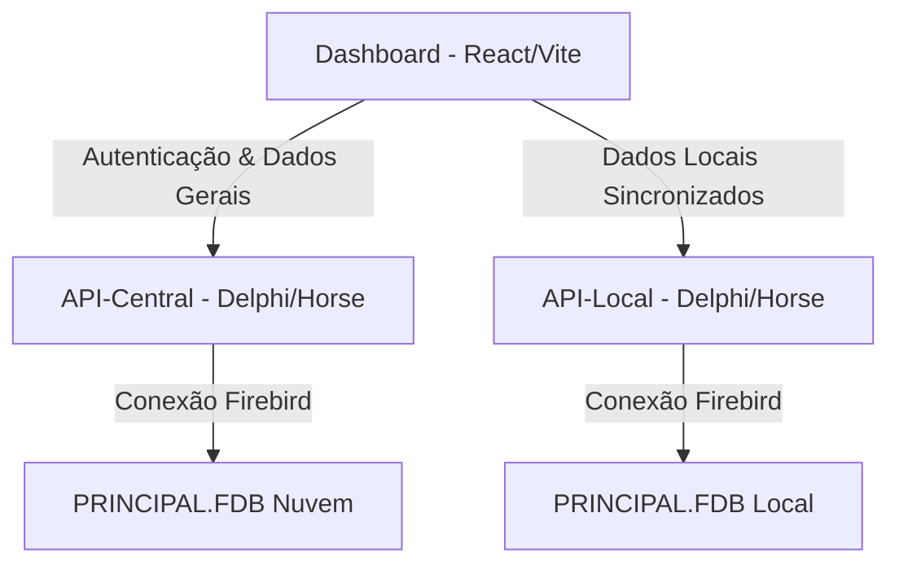

# Portal Gerencial - Dashboard

Uma aplicação web de alta performance desenvolvida para monitoramento gerencial e análise de indicadores comerciais e financeiros em tempo real. O sistema consolida dados operacionais de clientes, produtos, movimentações e recebimentos, apresentando-os em uma interface moderna, intuitiva e responsiva.

---

## Arquitetura do Sistema e Ecossistema

O **Dashboard** é o frontend de um ecossistema integrado que interage diretamente com bancos de dados relacionais **Firebird (`.FDB`)** por meio de APIs robustas desenvolvidas em **Delphi** com o framework **Horse**:



- **API-Central**: Controla cadastro/login por CPF, refresh token, alteração de senha e vínculo entre clientes e empresas. Para testes locais, roda em `http://localhost:3333`.
- **API-Local**: Serve dados específicos da operação da empresa a partir do banco de dados local e valida o JWT emitido pela API-Central.

---

## Principais Funcionalidades

### 1. Autenticação e Segurança
- **Cadastro e login por CPF**: Cadastro em `/v1/register` e autenticação em `/v1/login`, com validação local de confirmação de senha.
- **Vínculo e seleção de empresa**: Após o login, a tela de empresas lista `/v1/companies/linked`, testa `/v1/ping` na API Local de cada empresa e permite vincular novas empresas por CNPJ + claim.
- **Silent Token Refresh**: Interceptor Axios configurado na camada HTTP. Caso o token de acesso (JWT) expire (retorno `401 Unauthorized`), o sistema renova a credencial automaticamente em segundo plano via `/v1/refresh-token` e reexecuta a chamada original sem interrupções para o usuário.
- **Tratamento de Bypass**: Configurado para ignorar avisos de navegação do ngrok (`ngrok-skip-browser-warning`).
- **Segurança de Acesso**: Modal integrado para alteração segura de senha com validações locais detalhadas (caracteres em branco, espaços repetidos, confirmação de senha).

### 2. Painel de Indicadores Gerais (Tab Geral)
- **Métricas Consolidadas**: Exibição rápida de KPIs importantes:
  - Total de Clientes cadastrados.
  - Quantidade de Produtos Ativos.
  - Volume de Movimentações efetuadas.
  - Valor total acumulado dos Recebimentos Visíveis.
- **Visualização Dinâmica**: 4 gráficos analíticos construídos com **Recharts**:
  - **Movimentações**: Relação temporal de Créditos (Entradas) vs. Débitos (Saídas).
  - **Recebimentos por Status**: Visão geral de recebíveis.
  - **Níveis de Estoque**: Quantidades gerais de produtos em estoque.
  - **Clientes por Estado**: Distribuição geográfica de clientes agrupada por UF com tooltips interativos.
- **Feeds de Atividade**: Listas rápidas exibindo as últimas movimentações financeiras e os clientes recém-cadastrados com paginação local dedicada.

### 3. Módulos Detalhados (Tabs Independentes)
- **Clientes**: Tabela completa com pesquisa dinâmica multi-campo integrada (filtra simultaneamente por nome, celular, e-mail, cidade ou UF).
- **Produtos**:
  - Painel de alerta inteligente com badges informativas de **Estoque Baixo** (1 a 3 unidades) e **Sem Estoque** (0 unidades).
  - Filtros rápidos por status de estoque.
  - Cores dinâmicas na tabela para sinalizar problemas críticos de estoque.
- **Movimentações**: Histórico financeiro detalhado com coloração automática que diferencia Crédito (Verde `+`) de Débito (Vermelho `-`).
- **Recebimentos**:
  - Filtros rápidos de duplicatas por status (Em aberto, Pago Parcial, Pago Total).
  - Identificação automática e destaque visual para duplicatas vencidas (onde a data de vencimento é menor que o dia atual e o estado é "Em aberto").

---

## Stack Tecnológica

- **Core**: [React JS (v19)](https://react.dev/) & [Vite (v8)](https://vite.dev/) para empacotamento rápido e Hot Module Replacement (HMR).
- **Roteamento**: [React Router DOM (v7)](https://reactrouter.com/) para gerenciamento de páginas e parâmetros de busca (`searchParams`).
- **Visualizações**: [Recharts (v3)](https://recharts.org/) para a renderização de gráficos SVG fluidos, responsivos e customizados.
- **Iconografia**: [Lucide React](https://lucide.dev/) para ícones minimalistas e consistentes.
- **Comunicação**: [Axios](https://axios-http.com/) para consumo HTTP, interceptores de tratamento de erros e renovação de credenciais.
- **Estilização**: CSS Vanilla moderno seguindo o guia de design *Corporate Modern + High-Contrast Minimalism*, com suporte para glassmorphism sutil em barras de navegação e componentes em cards suspensos (Level 0 a Level 3 de profundidade).

---

## Como Rodar o Projeto Localmente

### Pré-requisitos
Certifique-se de possuir o [Node.js](https://nodejs.org/) instalado em sua máquina (versão 18 ou superior recomendada).

### Passo 1: Clonar o projeto e instalar dependências
Navegue até a pasta `Dashboard` no seu terminal e execute:
```bash
npm install
```

### Passo 2: Executar em Modo de Desenvolvimento
Inicie o servidor local do Vite:
```bash
npm run dev
```
O console exibirá o endereço local (geralmente `http://localhost:5173`). Abra no seu navegador.

### Passo 3: Configurando as APIs
A aplicação usa `http://localhost:3333` como URL padrão da **API-Central**. Para apontar para outro endereço, defina `VITE_AUTH_API_BASE` antes de iniciar o Vite.

Depois do login, a tela de empresas busca automaticamente as empresas vinculadas na **API-Central** e indica quais APIs Locais respondem ao `/v1/ping`. Para vincular uma empresa existente, informe:
- CNPJ da empresa.
- Claim exibido no terminal da API Local.

---

## Produção e Otimização
Para gerar a versão otimizada de produção e armazenar os arquivos estáticos na pasta `/dist`:
```bash
npm run build
```
Para testar localmente o build gerado:
```bash
npm run preview
```
